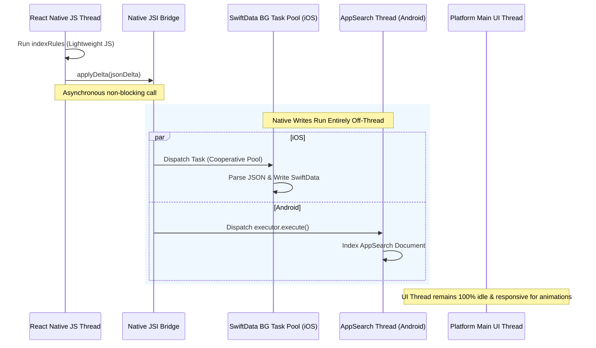

# AI Assistant Integration Guide: Off-Thread Performance, Denormalization, & Custom Intents

This guide explains how `convex-rn` manages threading performance, details critical pitfalls when presenting data to system AI agents, and provides blueprints for implementing app-specific custom intents.

---

## 1. Threading & UI Responsiveness Architecture

A primary concern is ensuring that synchronization, indexing, and write operations do not block the React Native UI thread (causing dropped frames or frozen touch inputs).



### How Threading is Managed:
1. **JavaScript Thread**: The JS thread executes the `indexRules` functions. Because JS runs in a separate thread from the native UI rendering thread in React Native, this will not block UI animations. Furthermore, MMKV operations utilize fast, synchronous memory-mapped files (averaging <0.5ms per write).
2. **iOS Native Threading**: Inside `ConvexBridge.swift`, database writes use Swift's `Task` cooperative thread pool. The `ModelContext` reads and writes are offloaded to background threads. The main thread (UIKit/SwiftUI) is never touched during ingestion.
3. **Android Native Threading**: Inside `ConvexBridgeModule.kt`, all AppSearch tasks are queued inside a single-threaded background `ExecutorService`. The Android Main UI thread remains unblocked.
4. **Headless Execution**: When Siri or Gemini execute background intents/functions, the React Native JS runtime does not boot. The OS Assistant queries the local database container directly, achieving sub-second query execution.

---

## 2. The Pitfalls of Relational Data in AI Systems

In traditional app development, databases are normalized (e.g. keeping `events` and `users` tables separate, joining them on `userId`). If you pass normalized relational structures directly to system assistants, your Siri and Gemini integrations will fail in several ways:

### Pitfall 1: No Joins in System Search (Spotlight & AppSearch)
*   **The Issue**: iOS Spotlight and Android AppSearch are **flat search indexers**, not relational SQL databases. They build inverted text indexes. If a user searches *"Erin"* in Spotlight, the system queries the text indexes. If the `Event` entity only stores `attendeeIds: ["user_123"]`, the system cannot match *"Erin"* to the event.
*   **The Fix**: Always denormalize text keywords (like names, tags, or category titles) directly into the parent document's `indexableText` array.

### Pitfall 2: High Latency & Battery Drain of Runtime Joins
*   **The Issue**: If your custom `AppIntent` queries the database and runs manual loops to parse raw JSON payloads and perform joins at runtime, Siri will lag, and the OS may terminate the intent for exceeding execution time limits.
*   **The Fix**: Pre-calculate searchable keywords in TypeScript using `indexRules` during the sync phase. Let the device write a flat list of keywords to the database once, so queries run instantly at runtime.

### Pitfall 3: Multi-Step Tool Chaining Failures
*   **The Issue**: Expecting Siri's or Gemini's LLM to chain tools (e.g., call `findUserByName` $\rightarrow$ parse output $\rightarrow$ call `findEventsForUser`) increases latency and introduces points of failure.
*   **The Fix**: Expose coarse-grained, specialized intents (e.g., `SearchAttendance`) that answer direct questions in a single database lookup.

---

## 3. Developer Framework: Mapping Questions to Schemas

When designing your app's sync rules, use this framework to map questions to your database setup:

| User Question | Entity to Query | Indexable Text Needs | Specialized Intent |
| :--- | :--- | :--- | :--- |
| *"When was the last time Erin was at an event?"* | `ConvexEntity` (table: "events") | Denormalize attendee names into the event record | `GetLastEventForAttendeeIntent` |
| *"What tasks are high priority for the redesign?"* | `ConvexEntity` (table: "tasks") | Include `redesign` and `high` as tags in the indexable array | `GetTasksByPriorityIntent` |
| *"Who attended the product launch?"* | `ConvexEntity` (table: "events") | Denormalize attendees' full names | `GetEventAttendeesIntent` |

---

## 4. iOS Custom AppIntent Blueprints (Swift)

Below are samples showing how developers can implement custom iOS App Intents querying the generic `ConvexEntity` table.

### Sample 1: Relational Query Intent (Finding Last Attendance)
This intent satisfies the question: *"When was the last time [Attendee] was at an event?"*

```swift
import AppIntents
import SwiftData
import Foundation

public struct GetLastEventForAttendeeIntent: AppIntent {
    public static var title: LocalizedStringResource = "Get Last Event For Attendee"
    public static var description = IntentDescription("Finds the most recent event attended by a specific person.")

    @Parameter(title: "Attendee Name")
    var attendeeName: String

    // Injected globally by the convex-rn library
    @Dependency private var modelContainer: ModelContainer

    public func perform() async throws -> some IntentResult & ReturnsValue<String> {
        let context = ModelContext(modelContainer)
        
        // 1. Fetch events where the attendee name is denormalized in indexableText
        let descriptor = FetchDescriptor<ConvexEntity>(
            predicate: #Predicate<ConvexEntity> { 
                $0.table == "events" && $0.indexableText.contains(attendeeName) 
            },
            sortBy: [SortDescriptor(\.updatedAt, order: .reverse)]
        )
        
        do {
            let events = try context.fetch(descriptor)
            guard let lastEvent = events.first else {
                return .result(value: "No events found for \(attendeeName).")
            }
            
            // 2. Decode the JSON data payload for detail output
            if let data = lastEvent.jsonData.data(using: .utf8),
               let json = try? JSONSerialization.jsonObject(with: data) as? [String: Any],
               let title = json["title"] as? String {
                let formatter = DateFormatter()
                formatter.dateStyle = .medium
                let dateStr = formatter.string(from: lastEvent.updatedAt)
                return .result(value: "\(attendeeName) was last at '\(title)' on \(dateStr).")
            }
            
            return .result(value: "Found an event, but could not parse details.")
        } catch {
            return .result(value: "Failed to query database: \(error.localizedDescription)")
        }
    }
}
```

---

## 5. Android Custom AppFunction Blueprints (Kotlin)

Below is the Android Jetpack AppFunction counterpart mapping the same relational query for Gemini:

```kotlin
package com.convexrn.appfunctions

import androidx.appfunctions.AppFunctionContext
import androidx.appfunctions.service.AppFunction
import androidx.appsearch.app.SearchSpec
import androidx.appsearch.platformstorage.PlatformStorage
import java.util.concurrent.Executors
import kotlin.coroutines.resume
import kotlin.coroutines.resumeWithException
import kotlin.coroutines.suspendCancellableCoroutine
import org.json.JSONObject

class AttendanceAppFunctions {

    /**
     * Finds the last event attended by a person.
     *
     * @param appFunctionContext Context for Android AppFunction execution.
     * @param attendeeName The name of the person whose last event we want to find.
     * @return A descriptive summary of the attendee's last event.
     */
    @AppFunction(isDescribedByKDoc = true)
    suspend fun getLastEventForAttendee(
        appFunctionContext: AppFunctionContext,
        attendeeName: String
    ): String {
        val context = appFunctionContext.context
        
        // Open AppSearch session
        val session = suspendCancellableCoroutine { continuation ->
            val sessionFuture = PlatformStorage.createSearchSessionAsync(
                PlatformStorage.SearchContext.Builder(context, "convex_database").build()
            )
            sessionFuture.addListener({
                try { continuation.resume(sessionFuture.get()) } catch (e: Exception) { continuation.resumeWithException(e) }
            }, Executors.newSingleThreadExecutor())
        }

        try {
            // Search events namespace where attendeeName matches
            val searchSpec = SearchSpec.Builder()
                .addFilterNamespaces("convex_table_events")
                .setSnippetCount(1)
                .build()
            
            // Search AppSearch index
            val searchResults = session.search(attendeeName, searchSpec)
            val page = suspendCancellableCoroutine { continuation ->
                val nextFuture = searchResults.nextPageAsync
                nextFuture.addListener({
                    try { continuation.resume(nextFuture.get()) } catch (e: Exception) { continuation.resumeWithException(e) }
                }, Executors.newSingleThreadExecutor())
            }

            if (page.isEmpty()) {
                return "No events found matching $attendeeName."
            }

            // Grab the most recent match
            val resultDoc = page.first()
            val genericDoc = resultDoc.genericDocument
            val jsonData = genericDoc.getPropertyString("jsonData") ?: return "Event found, but payload is empty."
            
            val json = JSONObject(jsonData)
            val title = json.optString("title", "Unnamed Event")
            val timestamp = genericDoc.getPropertyLong("updatedAt")
            
            val dateStr = java.text.DateFormat.getDateInstance().format(java.util.Date(timestamp))
            return "$attendeeName was last at '$title' on $dateStr."

        } catch (e: Exception) {
            return "Failed to query events: ${e.message}"
        } finally {
            session.close()
        }
    }
}
```

---

## 6. Prompt Instructions for Developer AI Agents

When utilizing coding agents (like Cursor, Gemini, or Copilot) to add custom assistant intents to your project, paste this prompt into your agent sidebar to automatically generate correctly configured code:

```text
You are an expert iOS SwiftData / Android Jetpack AppFunctions developer.
I am using the 'convex-rn' package which syncs my backend data to a generic local database.
The database schema on the device consists of:
- iOS: 'ConvexEntity' class (fields: id, table, updatedAt, indexableText: [String], jsonData: String)
- Android: 'ConvexDocument' schema (properties: id, namespace: String, updatedAt: Long, indexableText: List<String>, jsonData: String)

I have a feature that tracks: [INSERT YOUR APP FEATURE NAME / TABLES, e.g. Attendance at Events]
I want my users to be able to ask Siri or Gemini: [INSERT QUESTION, e.g. "When was the last time X was at an event?"]

Please generate:
1. An iOS AppIntent class using the '@AssistantIntent(schema: ...)' macro that fetches the appropriate 'ConvexEntity' elements, handles JSON parsing of the 'jsonData' payload, and returns a user-facing string. Use the registered '@Dependency private var modelContainer: ModelContainer' for query execution.
2. An Android Jetpack AppFunction class using '@AppFunction(isDescribedByKDoc = true)' that searches the local 'convex_database' AppSearch session and returns a corresponding string. Include strict parameter constraints and robust KDocs.
```

---

## 7. Multi-User Conflict Resolution & Timestamp Reconciliation

When building local-first applications where multiple users can write to the same documents offline, conflict resolution becomes crucial:
*   **The Conflict**: User A goes offline and edits a document at 10:00 AM. User B remains online and edits the same document at 10:05 AM. When User A reconnects at 10:10 AM, we want to ensure User A's **older** write does not blindly overwrite User B's **newer** write on the server.
*   **The Solution**: Reconcile changes on the server using **Client-Side Timestamps** (`updatedAt`).

### Step 1: Pass `updatedAt` in client-side mutations
When calling `performMutation`, always include the client-side timestamp in both the local optimistic fields and the remote mutation arguments:

```typescript
const now = Date.now();
await syncEngine.performMutation(
  'tasks',          // Table name
  'tasks:update',   // Convex mutation path
  taskId,
  { title: "New Title", updatedAt: now }, // Local optimistic fields
  { id: taskId, title: "New Title", updatedAt: now } // Remote mutation arguments
);
```

### Step 2: Implement reconciliation in Convex mutations
In your server-side Convex mutations, validate the incoming `updatedAt` argument. Check the existing document in the database, and only apply the patch if the incoming timestamp is newer than the database document's timestamp:

```typescript
import { mutation } from "./_generated/server";
import { v } from "convex/values";

export const update = mutation({
  args: {
    id: v.id("tasks"),
    title: v.string(),
    updatedAt: v.number(), // Enforce client timestamp validation
  },
  handler: async (ctx, args) => {
    const existing = await ctx.db.get(args.id);
    
    if (existing) {
      // Reconcile: If the server document is already newer, discard the incoming older write
      if (existing.updatedAt && existing.updatedAt >= args.updatedAt) {
        console.log(`[Conflict Resolution] Discarded older write for task ${args.id} (Incoming: ${args.updatedAt}, Server: ${existing.updatedAt})`);
        return; // Safe discard, no database mutation
      }
    }
    
    // Apply the write
    await ctx.db.patch(args.id, {
      title: args.title,
      updatedAt: args.updatedAt,
    });
  },
});
```

### Automatic Client UI Reverts
When the server discards an older write, it does not modify the database. Because `convex-rn` maintains active WebSocket query subscriptions (`onUpdate`), the client automatically receives the server's correct, newer document state. This pushed update will overwrite the local cache, automatically **reverting the client's optimistic update** on screen to match the true, newer state of the database.

---

## 8. Handling Relational Lists & Arrays (Offline Conflict Merging)

When multiple users modify lists or take attendance offline concurrently, a blind overwrite (Last-Write-Wins) would lose data. Because Convex mutations run standard TypeScript on the server, you can resolve conflicts dynamically.

Here are the three strategies for managing arrays and relational lists under offline conditions:

### Strategy 1: Coarse-Grained Operations (Add/Remove Actions)
Instead of overwriting the entire array, send single additions or removals as operations.

1. **Client Call**:
```typescript
await syncEngine.performMutation(
  'events',
  'events:addAttendee',
  eventId,
  { /* optimistic UI changes */ },
  { eventId, userId: attendeeId }
);
```

2. **Server Mutation**:
```typescript
export const addAttendee = mutation({
  args: { eventId: v.id("events"), userId: v.string() },
  handler: async (ctx, args) => {
    const event = await ctx.db.get(args.eventId);
    if (!event) return;
    
    // Union-append using a Set to avoid duplicates
    const attendees = new Set(event.attendees || []);
    attendees.add(args.userId);
    
    await ctx.db.patch(args.eventId, {
      attendees: Array.from(attendees)
    });
  }
});
```

---

### Strategy 2: Array Merging (Set Union)
If your client needs to push arrays, perform a set union merge on the server instead of a blind replacement.

```typescript
export const mergeAttendees = mutation({
  args: { eventId: v.id("events"), deviceAttendees: v.array(v.string()) },
  handler: async (ctx, args) => {
    const event = await ctx.db.get(args.eventId);
    if (!event) return;

    const merged = Array.from(new Set([
      ...(event.attendees || []),
      ...args.deviceAttendees
    ]));

    await ctx.db.patch(args.eventId, { attendees: merged });
  }
});
```

---

### Strategy 3: Relational Join Tables (Scalable & Zero-Conflict)
Storing list arrays inside a single document has scale limits. The most robust database pattern is creating a join table.

1. **Schema Definition**:
```typescript
// convex/schema.ts
attendance: defineTable({
  eventId: v.id("events"),
  userId: v.id("users"),
  attendedAt: v.number(),
}).index("by_event", ["eventId"])
```

2. **Client Call**:
```typescript
// Each check-in creates a separate document, guaranteeing zero conflict
await syncEngine.performMutation(
  'attendance',
  'attendance:create',
  checkInId, // Unique ID generated on the client
  { eventId, userId, attendedAt: Date.now() },
  { eventId, userId, attendedAt: Date.now() }
);
```
