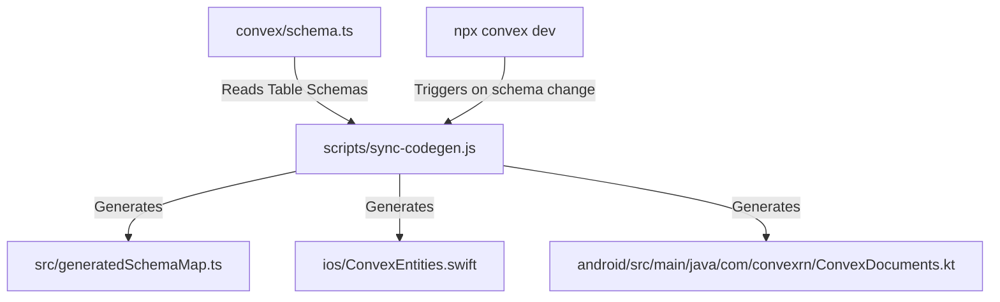

# Codegen Automation Guide: Keeping Convex & Mobile Schemas in Sync

> [!CAUTION]
> Prototype notes only. Not a supported product feature. See [STATUS.md](../STATUS.md).

As your Convex backend schema grows and changes, maintaining manual duplicate declarations in iOS (SwiftData), Android (AppSearch), and React Native TypeScript (`schemaMap`) becomes a liability. 

We can automate this process entirely by writing a **Codegen compiler script** that hooks into the Convex developer lifecycle.

---

## 1. Codegen Architecture Workflow

Instead of writing schemas by hand, the developer runs `npx convex dev` which compiles the backend. A watcher or post-compile hook then runs our `sync-codegen.js` script to generate platform models.



---

## 2. The Codegen Parser Script (`scripts/sync-codegen.js`)

Below is a complete, runnable Node.js script that parses a Convex `schema.ts` file using basic JavaScript token parsing and outputs the corresponding Swift, Kotlin, and TypeScript mappings.

```javascript
// scripts/sync-codegen.js
const fs = require('fs');
const path = require('path');

// Paths configuration
const SCHEMA_PATH = path.resolve(__dirname, '../convex/schema.ts');
const TS_OUTPUT_PATH = path.resolve(__dirname, '../src/generatedSchemaMap.ts');
const SWIFT_OUTPUT_PATH = path.resolve(__dirname, '../ios/ConvexEntities.swift');
const KOTLIN_OUTPUT_PATH = path.resolve(__dirname, '../android/src/main/java/com/convexrn/ConvexDocuments.kt');

function parseConvexSchema() {
  if (!fs.existsSync(SCHEMA_PATH)) {
    console.warn('Convex schema.ts not found. Generating default mappings.');
    return [];
  }

  const content = fs.readFileSync(SCHEMA_PATH, 'utf8');
  const tables = [];
  
  // Basic regex matching defineTable("tableName", { fields })
  const tableRegex = /defineTable\(\s*["']([^"']+)["']\s*,\s*\{([\s\S]*?)\}/g;
  let match;

  while ((match = tableRegex.exec(content)) !== null) {
    const tableName = match[1];
    const fieldsBlock = match[2];
    const fields = [];

    // Parse individual field lines: title: v.string(), completed: v.boolean()
    const fieldLines = fieldsBlock.split('\n');
    for (let line of fieldLines) {
      line = line.trim();
      if (!line || line.startsWith('//')) continue;
      
      const parts = line.split(':');
      if (parts.length < 2) continue;
      
      const fieldName = parts[0].trim().replace(/["']/g, '');
      const typeIndicator = parts.slice(1).join(':').trim();
      
      let type = 'string';
      if (typeIndicator.includes('v.boolean')) type = 'boolean';
      if (typeIndicator.includes('v.number')) type = 'number';
      
      fields.push({ name: fieldName, type });
    }
    tables.push({ name: tableName, fields });
  }

  return tables;
}

function generateTypeScript(tables) {
  let code = `// Automatically generated by sync-codegen.js. Do not edit.\n\n`;
  code += `export const generatedSchemaMap: Record<string, { table: string }> = {\n`;
  
  for (const table of tables) {
    // Scaffold standard CRUD queries mapping to this table
    code += `  "${table.name}:list": { table: "${table.name}" },\n`;
    code += `  "${table.name}:getById": { table: "${table.name}" },\n`;
  }
  
  code += `};\n`;
  fs.writeFileSync(TS_OUTPUT_PATH, code);
  console.log(`[Codegen] TypeScript schema map written to: ${TS_OUTPUT_PATH}`);
}

function generateSwiftData(tables) {
  let code = `// Automatically generated by sync-codegen.js. Do not edit.\n`;
  code += `import Foundation\nimport SwiftData\n\n`;

  for (const table of tables) {
    // Generate class name capitalization (e.g. tasks -> TaskEntity)
    const className = table.name.charAt(0).toUpperCase() + table.name.slice(1).replace(/s$/, '') + 'Entity';
    
    code += `@Model\npublic final class ${className} {\n`;
    code += `    @Attribute(.unique) public var id: String\n`;
    
    for (const field of table.fields) {
      let swiftType = 'String';
      if (field.type === 'boolean') swiftType = 'Bool';
      if (field.type === 'number') swiftType = 'Double';
      code += `    public var ${field.name}: ${swiftType}\n`;
    }
    code += `    public var updatedAt: Date\n\n`;

    // Constructor
    const initParams = table.fields.map(f => {
      let t = 'String';
      if (f.type === 'boolean') t = 'Bool';
      if (f.type === 'number') t = 'Double';
      return `${f.name}: ${t}`;
    }).join(', ');

    code += `    public init(id: String, ${initParams}, updatedAt: Date) {\n`;
    code += `        self.id = id\n`;
    for (const field of table.fields) {
      code += `        self.${field.name} = ${field.name}\n`;
    }
    code += `        self.updatedAt = updatedAt\n`;
    code += `    }\n`;
    code += `}\n\n`;
  }

  fs.writeFileSync(SWIFT_OUTPUT_PATH, code);
  console.log(`[Codegen] iOS SwiftData entities written to: ${SWIFT_OUTPUT_PATH}`);
}

function generateAndroidAppSearch(tables) {
  let code = `// Automatically generated by sync-codegen.js. Do not edit.\n`;
  code += `package com.convexrn\n\n`;
  code += `import androidx.appsearch.annotation.Document\n`;
  code += `import androidx.appsearch.app.AppSearchSchema\n\n`;

  for (const table of tables) {
    const className = table.name.charAt(0).toUpperCase() + table.name.slice(1).replace(/s$/, '') + 'Document';
    
    code += `@Document\ndata class ${className}(\n`;
    code += `    @Document.Namespace val namespace: String = "convex_${table.name}",\n`;
    code += `    @Document.Id val id: String,\n`;
    code += `    @Document.Score val score: Int = 0,\n`;
    code += `    @Document.LongProperty val updatedAt: Long,\n`;
    
    for (const field of table.fields) {
      if (field.type === 'boolean') {
        code += `    @Document.BooleanProperty val ${field.name}: Boolean,\n`;
      } else if (field.type === 'number') {
        code += `    @Document.LongProperty val ${field.name}: Long,\n`;
      } else {
        code += `    @Document.StringProperty(indexingType = AppSearchSchema.StringPropertyConfig.INDEXING_TYPE_PREFIXES) val ${field.name}: String,\n`;
      }
    }
    // Strip last trailing comma
    code = code.trim().replace(/,$/, '') + '\n)\n\n';
  }

  fs.writeFileSync(KOTLIN_OUTPUT_PATH, code);
  console.log(`[Codegen] Android AppSearch document schemas written to: ${KOTLIN_OUTPUT_PATH}`);
}

// Execute compilation
try {
  const tables = parseConvexSchema();
  if (tables.length > 0) {
    generateTypeScript(tables);
    generateSwiftData(tables);
    generateAndroidAppSearch(tables);
  }
} catch (e) {
  console.error('[Codegen] Error during schema generation:', e);
}
